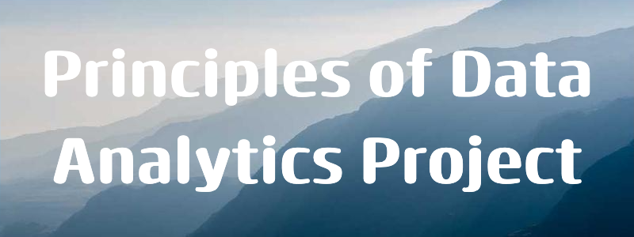

| **Topic**          | **Details**                        |
|--------------------|------------------------------------|
| **Module**         | 8632 - Principles of Data Analysis |
| **Lecturer**       | Dr. Ian McLoughinl                 |
| **Student Name**   | Michael Curley                     |
| **Student Number** | G00376456                          |


_The Palmer Penguins, artwork by @allison_horst_

<div>
<a target="_blank" href="https://docs.python.org/3/tutorial/index.html">
   </a>
<a target="_blank" href="https://www.anaconda.com/">
  
</a>
<a target="_blank" href="https://numpy.org/devdocs/index.html">
  
</a>
<a target="_blank" href="https://pypi.org/project/pandas/">
  
</a>
<a target="_blank" href="https://matplotlib.org/">
  
</a>
<a target="_blank" href="https://docs.github.com/en/get-started/writing-on-github/getting-started-with-writing-and-formatting-on-github/basic-writing-and-formatting-syntax">
  
</a>
<a target="_blank" href="https://www.latex-project.org/">
  
</a>
<a target="_blank" href="https://code.visualstudio.com/">
  
</a>
<a target="_blank" href="https://jupyter.org/">
  
</a>
</div>

-----

_This README has being written with [GitHub's Documentation on README's](https://docs.github.com/en/repositories/managing-your-repositorys-settings-and-features/customizing-your-repository/about-readmes) in mind. You should refer to that documentation for more information on writing an appropriate README for visitors to your 
repository._

_You can find out more about writing in MarkDown in [GitHub Documentation](https://docs.github.com/en/get-started/writing-on-github/getting-started-with-writing-and-formatting-on-github/basic-writing-and-formatting-syntax)_

---

## Table of Contents.

* [1.0 About this project](#10-about-this-project)
* [2.0 Use of this project](#20-use-of-this-project)
  * [2.1 Getting Started](#22-getting-started)
* [3.0 Get Started](#30-get-started)
  * [3.1 To get started follow these instructions](#31-to-get-stated-with-this-project-please-follow-these-steps)
  * [3.2 Quickstart - Colab Notebook](#32-alternatively-for-a-quick-start)
* [4.0 Get Help](#40-get-help)
  * [4.1 Issue Tracker](#41-issue-tracker)
  * [4.2 Contact Us](#42-contact-us)
* [Contribute](#50-contribute)
* [Author](#60-author)

## ***1.0 About this project***

This repository contains the Palmer Penguins dataset and Python code for analysing it using a variety of Python software modules such as [Pandas](https://pandas.pydata.org/), [NumPy](https://numpy.org/) and [Matplotlib](https://matplotlib.org/).

The Palmer Penguins dataset is a very popular dataset for data analysis and visualization tasks. It contains data on three different Penguin species collected on three islands in the Palmer Archipelago, in the Antarctica region. The data was collected by Allison Horst, Alison Hill and Dr. Kristen Gorman between 2007 and 2009, and includes measurements such as bill length, bill depth, flipper length, body mass and species information for the Adelie, Chinstrap, and Gentoo penguins which were observed in these regions between the aforementioned dates. 

According to [Allison Horst GitHub](https://github.com/allisonhorst/palmerpenguins/blob/main/README.md) "the goal of the palmer penguins is to provide a great dataset for data exploration and visualization, as an alternative to iris".


## 2.0 Use of this Project

This project has being used as a learning tool to introduce students to data analysis concepts and techniques using real-world datasets. The project provides Python based analysis tools for studying the Palmer Penguin dataset. Whether you're a researcher, student, or data enthusiast, this project offers a powerful set of tools and functionalities to analyze and visualize penguin datasets, particularly for those who are new to data analytics.

### 2.1 Getting Started

To start using the Python Penguins project, simply follow the steps outlined in the [Get Started](#30-get-started) section below. Once you have set up the project, you can begin exploring and analyzing penguin data right away.

## 3.0 Get Started

### 3.1 To get stated with this project please follow these steps:

1. Clone the repository to your local machine. 

```sh
git clone https://github.com/MikeCurleyCoosan/myproject.git

```
2. Download and install [Anaconda](https://www.anaconda.com/). Anaconda comes with its own set of pre-installed data science packages and tools, making it convenient for beginners to set up their environment quickly. The pre-installed packages that are required to work with the project are [Pandas](https://pandas.pydata.org/), [NumPy](https://numpy.org/) and [Matplotlib](https://matplotlib.org/).

3. Download and install [Visual Studio Code](https://code.visualstudio.com/). Visual Studio Code is a code editor with support for development operations like debugging, task running, and version control.

4. Download and install the latest version of [Git](https://git-scm.com/). Git is a free and open source version control system designed to handle everything from small to very large projects with speed and efficiency.

5. Navigate to the project directory in VS Code

### 3.2 Alternatively, for a quick-start

I used [Open in Colab](https://openincolab.com/) to generate the following clickable link. It opens the 'penguins.ipynb' notebooks in [Google Colab](https://colab.research.google.com/). You may also view/open the project in this way.

<a target="_blank" href="https://colab.research.google.com/github/MikeCurleyCoosan/myproject/blob/main/penguins.ipynb">
  
</a>


## 4.0 Get Help

If you encounter any issues or have questions about the project, there are several resources available to help you:

### 4.1 Issue Tracker

Visit our [issue tracker](https://github.com/MikeCurleyCoosan/myproject/issues) on GitHub to see if your problem has already been reported or to report a new issue. Feel free to join any ongoing discussions related to bugs or feature requests.

### 4.2 Contact Us

If you need further assistance or have any other inquiries, you can reach out to us via [email](G00376456@gatu.ie). We're here to help and will do our best to respond to your inquiries in a timely manner.

Please don't hesitate to reach out if you need help or have feedback on how we can improve the project.


## 5.0 Contribute 

Who maintains and contributes to the project

## 6.0 Author

### About Me: 

I am a student in the Higher Diploma in Data Analytics Course in ATU, Galway Ireland.


